

    <h1 align=center>BLOCKCHAIN</h1>

    
📌 Índice

- [Conceitos da Tecnologia ***BLOCKCHAIN***](#conceitos-da-tecnologia-blockchain)
  - [Blocos](#blocos)
  - [Mineração](#mineração)
  - [Node](#node)
- [Início da Blockchain: ***CRIPTOMOEDAS***](#início-da-blockchain-criptomoedas)
- [Whitepaper do ***BITCOIN***](#whitepaper-do-bitcoin)
- [Fundamentação Tecnológica ***BLOCKCHAIN***](#fundamentação-tecnológica-blockchain)
  - [***Hash***](#hash)
- [Criptografia de ***Chave Pública***](#criptografia-de-chave-pública)
- [Formação de Blocos](#formação-de-blocos)
- [Encadeamento](#encadeamento)
- [Plataforma ***BLOCKCHAIN***](#plataforma-blockchain)
  - [Rede ***Peer-to-Peer Blockchain***](#rede-peer-to-peer-blockchain)
- [Algoritmo de Consenso](#algoritmo-de-consenso)
  - [Fundamentos do Consenso](#fundamentos-do-consenso)
  - [Como os Algoritmos Comuns Implementam o Consenso](#como-os-algoritmos-comuns-implementam-o-consenso)
  - [Prova de Trabalho](#prova-de-trabalho)
  - [Prova de Participação](#prova-de-participação)
- [Ataque de 51%](#ataque-de-51)

# CONCEITOS DA TECNOLOGIA *BLOCKCHAIN*

**Blockchain** é definida de forma simples como um **livro-razão** descentralizado e distribuído que registra a 
rastreabilidade de um ativo digital. Desde a sua criação, os dados em uma blockchain não podem ser modificados e 
excluídos.

Um dos grandes problemas que a blockchain nasceu para resolver foi o **gasto duplo**. Não é possível enviar o mesmo
ativo para duas pessoas, algo que pode acontecer dentro de um banco de dados, dependendo da arquitetura com que ele foi 
criado.

Há algumas coisas que podem dar errado quando você tenta enviar um ativo digital para duas pessoas ao mesmo tempo.

- Algo pode ter dado errado no banco de dados (problema técnico).
- A conta do remetente pode ter sido hackeada
- Os limites de transferência do dia podem ter sido excedidos
- Debitado de uma conta, nunca creditando no outro lado
- Problemas com dados

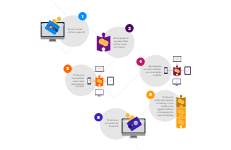

    
<code>IMAGEM | Como a blockchain funciona</code>

1. **A** quer enviar dinheiro para **B**
2. A transação é representada online como um "bloco"
3. O bloco é transmitido para cada participante na rede
4. As pessoas na rede atestam se a transação é válida
5. O bloco é então adicionado à cadeia, o que confere um registro idôneo (adequado) e transparente nas transições
6. O dinheiro é movido de **A** para **B**

Todas essas transações são armazenadas na estrutura de **livro-razão** digital. Funciona como uma planilha contendo 
todos os inúmeros nós de uma rede e tem o histórico de todas as compras feitas por cada nó. As informações contidas no
livro digital são altamente seguras e a assinatura digital protege contra adulterações.

Qualquer um pode ver os dados do livro-razão, mas ninguém pode corrompê-los. Só é possível inserir informações na 
blockchain, não é possível deletar nem alterar o dado que outro participante já inseriu.

> De forma geral:
> 
> - Blockchain é um banco de dados que armazena blocos de dados criptografados e os encadeia para formar uma única fonte
de verdade cronológica para os dados.
> - Os ativos digitais são distribuídos em vez de copiados ou transferidos, criando um registro imutável de um ativo.
> - O ativo é descentralizado, permitindo acesso total em tempo real e transparência ao público.
> - Um registro transparente de alterações preserva a integridade do documento, o que cria confiança no ativo.
> - As medidas de segurança inerentes ao Blockchain e o livro-razão público o tornam uma tecnologia primordial para
quase todos os setores.

(<a href="#readme-top">back to top</a>)

## Blocos

Um bloco consiste em uma lista de dados. Uma "cadeia" é um conjunto de blocos de dados que cresce constantemente ao
longo de um período de tempo. Se a transação estiver inserida na blockchain, será extremamente difícil ou impossível alterar esses dados. Isso torna a blockchain um meio único de armazenar dados valiosos.

Imagine uma torre digital de blocos, sobre a qual um novo bloco de dados é adicionado a cada 10 minutos a partir do 
"**bloco de gênese**" original na base da torre. Os dados em cada bloco consistem em transações financeiras transmitidas
por usuários da rede juntamente com evidências criptográficas de que essas transações são válidas.

A figura representa como os blocos são encadeados em uma blockchain:

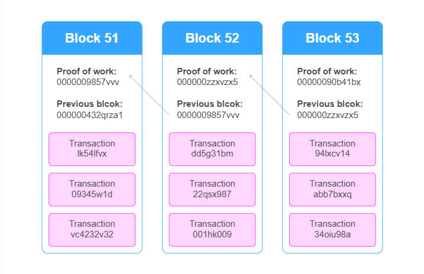

    
<code>IMAGEM | Encadeamento de blocos</code>

Cada bloco contém dados de transações financeiras transmitidas por usuários da rede (na imagem, as ***Transactions***), 
juntamente com evidências criptográficas de que essas transações são válidas (na imagem, as ***Proof of Work*** e 
***Previous block***).

(<a href="#readme-top">back to top</a>)

## Mineração

Mineração é a extração da moeda digital usando equipamentos especiais (computadores potentes).

A mineração é a junção de blocos que armazenam informações sobre transações. Como resultado, eles formam uma cadeia 
contínua e consistente.

Para anexar um bloco, é necessário resolver um determinado problema matemático decifrando o algoritmo da criptomoeda.
Caso o equipamento encontre a resposta correta, seu dono recebe uma recompensa em forma de moedas digitais, ou seja,
recebe Bitcoin.

Quanto mais os mineradores buscam resolver o problema matemático, mais difícil é encontrar a resposta certa e o custo
aumenta.

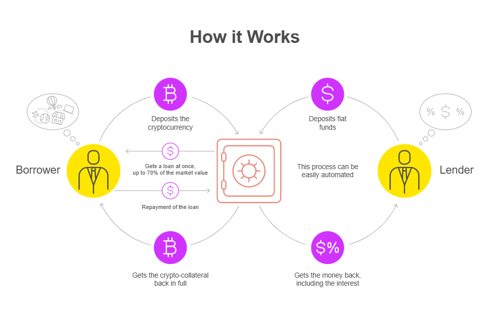

    
<code>IMAGEM | Processos</code>

1. Verifica Transações
2. Agrupa transações válidas em um **bloco "candidato"**
3. Insere a **hash** do bloco mais recente no bloco candidato
4. Resolve a **proof-of-work** (PoW)
5. Anexa o bloco candidato em uma blockchain local 
6. Propaga a solução na rede
7. Espera a verificação da solução por outros **nodes**
8. Pegue a recompensa

(<a href="#readme-top">back to top</a>)

## Node

Termo utilizado para cada transação registrada cronologicamente e distribuída para uma série de dispositivos conectados.
Esses dispositivos são chamados de **nós** (***Node***). Esses nós se comunicam dentro da rede e transferem informações
sobre transações e novos blocos.

É um componente crítico da infraestrutura blockchain. Ajuda a manter a segurança e a integridade da rede. O principal
objetivo de um nó blockchain é verificar cada lote de transações de rede, chamados de blocos. Cada nó é distinguido dos
outros por um identificador único.

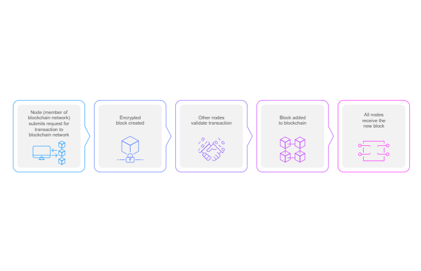

    
<code>IMAGEM | Nós</code>

1. **Node** (membro da rede blockchain) envia um pedido de transação para a rede blockchain
2. Bloco criptografado é criado
3. Outros nodes validam a transação
4. Bloco adicionado à blockchain
5. Todos os nodes recebem o novo bloco

Existem basicamente quatro tipos de nós (***Node***) em uma rede blockchain:

|       Node       | Descrição                                                                                                                                                                                                                                                            |
|:----------------:|:---------------------------------------------------------------------------------------------------------------------------------------------------------------------------------------------------------------------------------------------------------------------|
|  **Full Node**   | Executam a função de manter e distribuir cópias de todo o registro da blockchain, validando o histórico da blockchain e retransmitindo-o para outros nós da rede                                                                                                     |
| **Super Nodes**  | Operam 24 horas por dia para conectar os *full nodes* uns aos outros e espalhar a blockchain por toda a rede. Os *super nodes* servem como retransmissores de informações ou redistribuição para garantir que todos tenham a cópia correta da blockchain do Bitcoin. |
| **Light Nodes**  | Executam funções semelhantes aos *full nodes*, mas em uma capacidade menor. Eles contêm pequenas porções da blockchain em oposição à cópia inteira.                                                                                                                  |
| **Mining Nodes** | Resolvem problemas computacionais complexos usando hardware especializado por meio de "mineração", o processo de criação e adição de novos blocos à blockchain. Os mineradores bem-sucedidos recebem uma recompensa em Bitcoin por criar o novo bloco.               |

(<a href="#readme-top">back to top</a>)

# INÍCIO DA BLOCKCHAIN: *CRIPTOMOEDAS*

Ao contrário do dinheiro, a criptomoeda usa a blockchain para atuar como um livro público e um sistema de segurança 
criptográfico aprimorado, para que as transações online sejam sempre registradas e protegidas. O apelo das criptomoedas 
é que tudo está registrado em um livro público e protegido por criptografia, fazendo um registro irrefutável, com 
carimbo de data/hora e um seguro de cada pagamento.

Alguns dos motivos pelos quais as criptomoedas estão sendo tão adotadas:

- A segurança da Blockchain torna o roubo muito mais difícil, pois cada criptomoeda tem seu próprio número identificável 
irrefutável que é anexado a um proprietário.
- A criptografia reduz a necessidade de moedas e bancos centrais individualizados - Com a blockchain, a criptografia 
pode ser enviada para qualquer lugar e qualquer pessoa do mundo sem a necessidade de troca de moeda ou interferência 
de bancos centrais.

> **Sobre o bitcoin**
> - Sua criação até hoje é um mistério.
> - Seu criador se intitula Satoshi Nakamoto. Nakamoto: é a pessoa ou pessoas que desenvolveram o bitcoin.
> - Eles são anônimos e usam pseudônimos.

(<a href="#readme-top">back to top</a>)

# WHITEPAPER DO *BITCOIN*

Breve linha do tempo dos eventos mais importantes e notáveis no desenvolvimento da blockchain

    
<code>2008</code>

- Satoshi Nakamoto publica: "Bitcoin: A Peer to Peer Electronic Cash System".

    
<code>2009</code>

- A Primeira transação bem-sucedida de Bitcoin (BTC) ocorre entre o cientista da computação Hal Finney e Satoshi 
Nakamoto.

    
<code>2010</code>

- O programador Laszlo Hanyecz, na Flórida, concluiu a primeira compra usando o Bitcoin - duas pizzas Papa John's. 
Hanyecz pagou 10.000 BTC, cerca de US$ 60,00 na época. Hoje vale alguns milhões e a comunidade comemora esse dia como 
Bitcoin Pizza day.
- O valor do Mercado do Bitcoin excede oficialmente US$ 1 milhão.

    
<code>2011</code>

- 1 BTC = $ 1USD, dando a paridade da criptomoeda com o dólar americano
- Eletronic Frontier Foundation, Wikilieaks e outras organizações começam a aceitar Bitcoin como doações.

    
<code>2012</code>

- Blockchain e criptomoedas são mencionadas em programas de televisão populares como The Good Wife, injetando blockchain 
na cultura pop.
- A Bitcoin Magazine foi lançada por um dos desenvolvedores do BitCoin Vitalik Buterin.

    
<code>2013</code>

- O valor de mercado do BTC ultrapassou US$ 1 bilhão.
- O Bitcoin atingiu pela US$ 100/BTC pela primeira vez.
- Buterin publicou o artigo "Ethereum Project" sugerindo que a blockchain tenha outras possibilidades além do Bitcoin
  (por exemplo, contratos inteligentes)

    
<code>2014</code>

- A empresa de jogos Zynga, The D Las Vegas Hotel e Overstock.com começam a aceitar Bitcoin como pagamento.
- O Projeto Ethereum de Buterin é financiado por meio de uma Oferta Inicial de Moedas (ICO - Initial Coin Offering) 
arrecadando mais de US$18 milhões em BTC e abrindo novos caminhos para a blockchain.
- R3, um grupo de mais de 200 empresas de blockchain, é formado para descobrir novas maneiras de implementar blockchain 
em tecnologia
- PayPal anuncia integração com Bitcoin.

    
<code>2015</code>

- O número de comerciantes que aceitam BTC excede 100.00
- A NASDAQ e a empresa de blockchain de San Francisco Chain se unem para testar a tecnologia para negociar ações em 
empresas privadas.

    
<code>2016</code>

- A gigante da tecnologia IBM anuncia uma estratégia de blockchain para soluções de negócios baseadas em nuvem.
- O governo do Japão reconhece a legitimidade da blockchain e das criptomoedas.

    
<code>2017</code>

- Bitcoin atinge US$ 1.000/BTC pela primeira vez.
- O valor de mercado de criptomoedas atinge US$ 150 bilhões.
- O CEO do JP Morgan, Jamie Dimon, diz acreditar na blockchain como um tecnologia futura, dando ao sistema de 
 contabilidade um voto de confiança de Wall Street.
- O Bitcoin atinge seu máximo histórico em US$ 19.783,021/BTC
- Dubai anuncia que seu governo será movido à blockchain até 2020.

    
<code>2018</code>

- O Facebook se compromete a iniciar um grupo de trabalho em blockchain e sugere a possibilidade de criar sua própria
criptomoeda.
- A IBM desenvolve uma plataforma bancária baseada em, com grandes bancos como Citi e Barclays assinando. 

    
<code>2019</code>

- O presidente da China, Xi Jinping, abraça publicamente a blockchain, enquanto o banco central da China anuncia que está trabalhando em sua própria criptomoeda.
- O CEO do Twitter & Square, Jack Dorsey, anuncia que a Square contratará engenheiros de blockchain para trabalhar nos 
 futuros planos de criptomoedas da empresa.
- A bolsa de valores de Nova York (NYSE) anuncia a criação da Bakkt - uma empresa de carteira digital que inclui 
negociação de criptomoedas

    
<code>2020</code>

- Bitcoin quase chega a US$ 30.000/BTC até o final de 2020.
- PayPal anuncia que permitirá que usuários comprem, vendam e mantenham criptomoedas.
- As Bahamas se tornam o primeiro país do mundo a lançar sua moeda digital do banco central, apropriadamente conhecida
como "Sand Dollar".
- Blockchain se torna um jogador chave na luta contra a COVID-19, principalmente para armazenar com segurança dados de
- pesquisas médicas e informações de pacientes.

    
<code>2021</code>

- O detentor corporativo nº 1 do Bitcoin é o Grayscale Bitcoin Trust. Eles detêm 654.885 Bitcoins, ou 3.12% da oferta 
total
- O detentor corporativo nº2 do Bitcoin é a MicroStrategy. Eles detêm 124.391 Bitcoins.
- Bitcoin tornou-se moeda legal ao lado do dólar americano em El Salvador.
- Existem 16.531 criptomoedas listadas no CoinMarketCap.com
- Houve 485.814 contratos de token criados no Ethereum.
- De acordo com o CoinATMRadar, existem 34.479 caixas eletrônicos criptográficos controlados por 603 operadores em 77 
países.
- A Coinbase abriu seu capital em 2021 e tem um valor de mercado (valor total de todas as ações) de US$ 60 bilhões, 39 
alcançaram esse nível em 2021.

[Whitepaper do ***Bitcoin***](https://bitcoin.org/bitcoin.pdf).

(<a href="#readme-top">back to top</a>)

# FUNDAMENTAÇÃO TECNOLÓGICA *BLOCKCHAIN*

A blockchain usa alguns algoritmos criptográficos como blocos de construção. As funções de hash e criptografia de chave 
pública são cruciais para a funcionalidade e a segurança do ecossistema blockchain.

## *Hash*

Uma função hash é uma função matemática que pode receber qualquer número como entrada e produz uma saída em um intervalo
fixo de números. Por exemplo, funções de hash de 256 bits (que são comumente usadas em blockchain), produzem saídas no 
intervalo de 0 a 256.

Para ser considerada segura, uma função de hash precisa ser resistente a colisões, isso significa que é extremamente 
difícil (ao ponto de ser quase impossível) encontrar duas entradas que criem a mesma saída de hash. Conseguir isso 
requer alguns recursos diferentes:

> - Nenhuma fraqueza na função hash
> - Um grande número de saídas possíveis
> - Uma função de hash unidirecional (não pode derivar a entrada da saída)
> - Entradas semelhantes produzem saídas muito diferentes

Blockchain depende muito de funções de hash seguras para garantir que as transações não possam ser modificadas após 
serem armazenadas no livro-razão.

Para melhorar esse conceito, uma função hash recebe uma entrada de qualquer comprimento e cria uma saída de comprimento 
fixo.

Exemplo de uma função hash chamada *md5*:

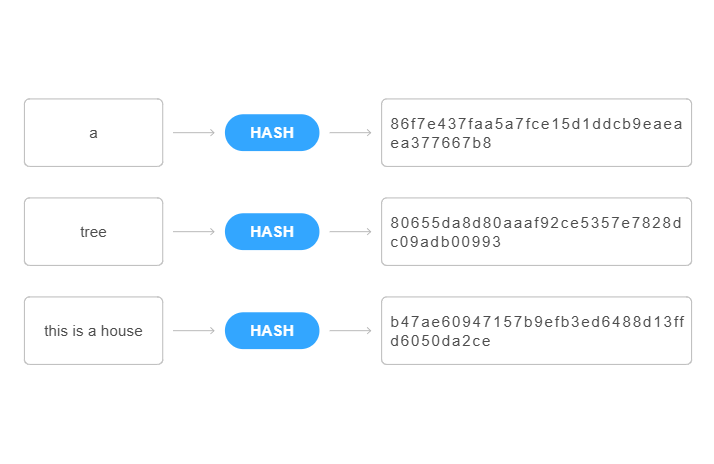

    
<code>IMAGEM | Hash</code>

Após passar pela função de hash, todos os resultados têm um mesmo comprimento e saídas bem diferentes.

(<a href="#readme-top">back to top</a>)

# CRIPTOGRAFIA DE *CHAVE PÚBLICA*

Com a criptografia de chave pública é possível:

> - Criptografar uma mensagem para que apenas o destinatário pretendido possa lê-la
> - Gerar uma assinatura digital comprovando que você enviou uma determinada mensagem
> - Verificar se uma mensagem não foi modificada no percurso.

Nas criptografia de chave pública, todos têm duas chaves de criptografia diferentes: uma **privada** e uma **pública**.
Sua chave privada é um número aleatório que você gera e mantém em segredo. Ele é usado para descriptografar mensagens e
gerar assinaturas digitais.

Chave pública é derivada da chave privada e foi projetada para ser distribuída publicamente. É usada para criptografar 
mensagens para você e gerar assinaturas digitais. Seu endereço (para onde as pessoas enviatam transações) na blockchain 
normalmente é derivado de sua chave pública.

A segurança da chave pública é baseada em duas coisas. A primeira é o sigilo da chave privada. Se alguém puder adivinhar
ou roubar sua chave privada, terá controle total de sua conta na blockchain. Isso permite que realize transações em seu 
nome e descriptograde os dados destinados a você.

A outra suposição principal da criptografia de chave pública é que os algoritmos usados são seguros. A criptografia de 
chave pública é baseada em problemas matemáticos complexos, em que realizar uma operação é muito mais fácil do que 
revertê-la. Por exemplo, é fácil realizar a exponenciação, mas difícil calcular logaritmos. Como resultado, é possível 
criar esquemas em que os computadores sejam capazes de realizar a operação fácil, mas não a difícil.

(<a href="#readme-top">back to top</a>)

# FORMAÇÃO DE BLOCOS

Blockchain é uma coleção de blocos que são encadeados para criar um todo contínuo.

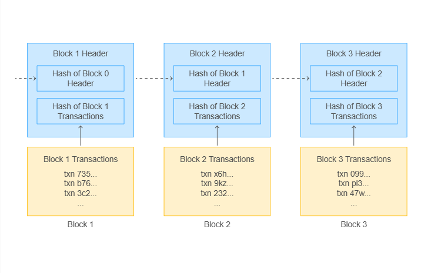

    
<code>IMAGEM | Formação de blocos</code>

A imagem representa a estrutura básica de um bloco em uma blockchain. Cada quadrado amarelo representa uma transação 
dentro do bloco. Embora uma transação possa representar uma transação literal (ou seja, uma tranferência de valor) em 
blockchains como o Bitcoin.

A segurança dos blocos no livro digital depende da segurança da criptografia de chave pública. Cada transação e bloco na
blockchain são assinados digitalmente por seu criador. Isso permite que qualquer pessoa com acesso à blockchain valide 
facilmente que cada transação é autenticada (ou seja, enviada por alguém que possui a conta associada) e não foi 
modificada desde a criação. A integridade e autenticação dos blocos da cadeia também são asseguradas pela assinatura 
digital do criador do bloco.

(<a href="#readme-top">back to top</a>)

# ENCADEAMENTO

Cada bloco equivale a uma única página no livro-razão. Para combinar esses slides em um todo contínuo, a blockchain faz 
uso de funções de hash.

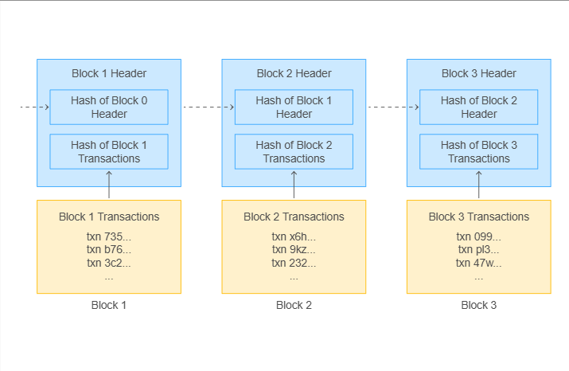

    
<code>IMAGEM | Blocos</code>

Na imagem é possível ver as funções de hash ligando cada bloco. Cada bloco contém o hash do bloco anterior como parte de
seu cabeçalho de bloco (a seção que não contém dados de transação).

O fato de cada bloco ser dependente do anterior é significativo devido à resistência à colisão das funções hash. Se 
alguém quiser forjar o bloco 1, tem duas opções: encontrar outra versão do bloco 1 que tenha o mesmo hash ou forjar 
todos os blocos após o 2 também. A primeira deve ser impossível (devido à resistência à colisão) e a outra deve ser 
difícil ou impossível, já que a blockchain é projetada para dificultar o forjamento de um único bloco.

A segurança da parte "cadeia" da blockchain é baseada na resitência à colisão da função hash que ela usa. Se alguém 
puder encontrar uma maneira de gerar outra versão do bloco 1 que tenha o mesmo hash, as suposições de imutabilidade da 
blockchain serão quebradas e você não poderá confiar em qualquer transação permanecerá no livro distribuído.

(<a href="#readme-top">back to top</a>)

# PLATAFORMA *BLOCKCHAIN*

A blockchain foi projetada para armazenar um livro-razão distribuído confiável e compartilhado, que representa todo 
histórico da rede blockchain.

## Rede *Peer-to-Peer Blockchain*

Blockchain não é grande em intermediários confiáveis, então ela usa uma rede ponto a ponto, em que cada nó da rede se 
comunica diretamente com outros nós.

A maioria das redes blockchains usa um sistema de transmissão no qual, se um nó tiver cinco pares, cada mensagem 
recebida de um é enviada para os outros quatro. Dessa forma, as mensagens se espalham pela rede por muitos caminhos e 
ninguém tem controle total sobre as comunicações, fazendo com que a informação se espalhe muito rápido.

A principal implicação do modelo *peer-to-peer* para a rede blockchain é que a rede subjacente precisa ser capaz de 
suportá-la. Como cada peer precisa ser capaz de se conectar a todos os outros peers, você não pode efetivamente ter uma 
rede blockchain distribuída em uma rede com níveis de confiança variados sem comprometer a blockchain ou a segurança da
rede. Além disso, o estilo de comunicação "broadcast" da blockchain significa que requer uma grande quantidade de 
largura de banda para funcionar corretamente. A incapacidade de suportar isso pode ter impactos negativos na segurança e
eficácia da blockchain.

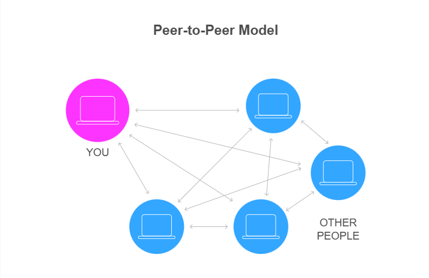

    
<code>IMAGEM | Modelo peer-to-peer</code>

Você (*peer* - bolinha rosa) se comunicando com outros *peers*. Todos se comunicando com todos na rede. 

(<a href="#readme-top">back to top</a>)

# ALGORITMO DE CONSENSO

Blockchain é projetada para remover autoridades centralizadoras como bancos. Em vez disso, a rede blockchain mantém um 
registro compartilhado e descentralizado co cada nó da rede mantendo uma cópia e atualizando-a à medida em que cada novo
bloco é criado.

O desafio com isso é garantir que todos os nós façam as mesmas atualizações em suas cópias do livro razão com cada 
bloco. Como a rede não possui uma autoridade consistente para criar a versão oficial do livro-razão, ela escolhe uma 
autoridade temporária para cirar e compartilhar cada bloco. O mecanismo para fazer isso é chamado de ***algoritmo de 
consenco blockchain***.

(<a href="#readme-top">back to top</a>)

## Fundamentos do Consenso

O trabalho do algoritmo de consenso é garantir que o controle da blockchain seja descentralizado para que nenhum usuário
tenha a capacidade de controlar a rede. O meio pelo qual isso é feito é tornar o controle da rede blockchain dependente 
do controle de um recurso escasso.

Não importa qual algoritmo de consenso você escolha, tudo se resume ao fato de que o controle de um recurso escasso 
equivale a poder na blockchain. Na ***Proof of Work***, esse recurso é o poder computacional, em ***Proof of Stake***, é
a criptomoeda da blockchain.

A lógica por trás do uso de um recurso escasso como análogo para alimentar a blockchain é que ele permite o uso de 
incentivos econômicos para proteger a blockchain. A **Lei da Oferta e da Demanda** diz que: se houver aumento da demanda
por um recurso com oferta limitada, o preço aumenta.

Quando um invasor tenta obter o controle de uma rede blockchain (para realizar um ataque de 51% ou similar), ele precisa
adquirir mais recursos escassos para fazê-lo. Como resultado, eles aumentam a demanda pelo recurso, o que aumenta o 
preço para adquiri-lo. Espera-se que o custo para adquirir recursos suficientes para realizar um ataque bem-sucedido 
esteja além dos recursos do invasor. Caso contrário, temos ataques bem-sucedidos de 51% contra blockchains, o que 
certamente aconteceu em redes menores de criptomoedas.

(<a href="#readme-top">back to top</a>)

## Como os Algoritmos Comuns Implementam o Consenso

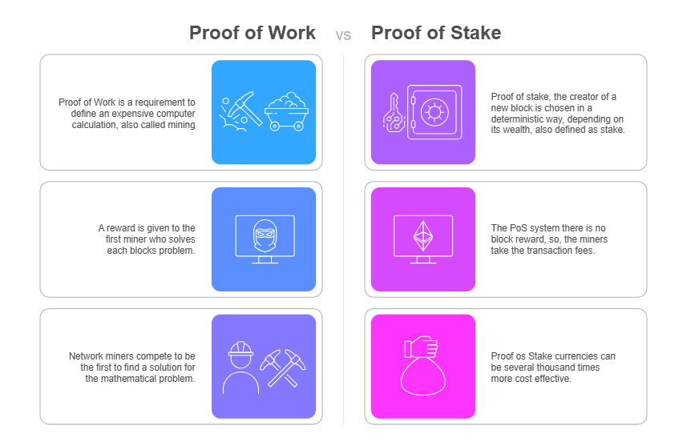

    
<code>IMAGEM | Proof of Work vs. Proof of Stake</code>

| Proof of Work                                                                                                        | Proof of Stake |
|:---------------------------------------------------------------------------------------------------------------------| :--- |
| ***Proof of Work*** é um requisito para definir um cálculo computacional expensivo, também chamado de **mineiração** | ***Proof of Stake***, o criador de um novo bloco é escolhido de forma determinística, dependendo na sua riqueza, também definido como **participação** |
| Uma recompensa é dada para o primeiro mineirador que resolver os problemas de cada bloco                             | O sistema ***PoS*** (Proof of Stake) não tem uma recompensa por bloco, então, os mineiradores ganham as taxas das transação |
| Mineiradores da rede competem para serem os primeiros a achar uma solução para o problema matemático                 | Moedas de Proof of Stake podem ser milhares de vezes mais econômicas |

## Prova de Trabalho

A ***Proof of Work*** é o algoritmo de consenso original e envolve fazer as pessoas trabalharem. No Proof of Work, os 
mineradores são aqueles que tentam criar um novo bloco. A maneira como o criador do bloco é selecionado é implementando
uma corrida em que o vencedor cria o bloco (e ganha as recompensas associadas).

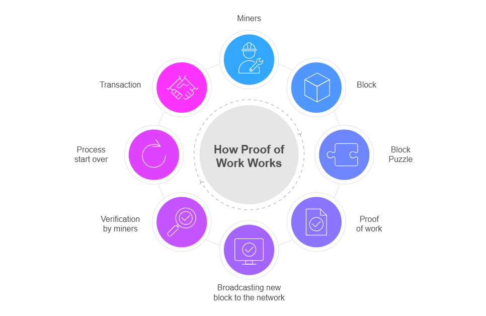

    
<code>IMAGEM | Como funciona o Proof of Work</code>

1. Mineiradores
2. Bloco
3. Problema do bloco
4. ***Proof of Work***
5. Transmissão do novo bloco para a rede
6. Verificação por mineiradores
7. Processo começa novamente
8. Transação

Essa corrida envolve a criação de um bloco válido, em que a condição de validade é que o cabeçalho do bloco tenha um 
valor menor que determinado limite. Devido às propriedades das funções de hash, a melhor maneira de fazer isso é 
adivinhando aleatoriamente. Como resultado, os mineradores na rede tentam hashes aleatórios até que se depare com um 
nonce que cria a saída de hash desejada. O primeiro minerador a encontrar um bloco válido o transmite para o resto da 
rede para construir o próximo bloco.

O principal problema com o **Proof of Work** é que o critério para a criação do bloco é a capacidade de criar um bloco
válido. Não há nada que diga que dois mineradores diferentes não podem encontrar versões diferentes do bloco ao mesmo
tempo. Se isso ocorrer, uma blockchain divergente pode ser criada com diferentes partes da rede sendo construídas em 
cima de diferentes blocos. Blockchain resolve isso usando a regra do bloco mais longo, que diz que, em um conflito 
entre duas versões da blockchain, a mais longa deve ser aceita.

**Proof of Work** também tenta minimizar a probabilidade de blockchains divergentes usando o conceito de dificuldade. O
valor limite que o hash de um cabeçalho de bloco válido deve ser menor do que pode ser atualizado de forma distribuída. 
A dificuldade é atualizada em intervalos regulares para que a criação de blocos ocorra na taxa de blocos desejada.

(<a href="#readme-top">back to top</a>)

## Prova de Participação

A ***Proof of Stake*** usa a escassa criptomoeda da blockchain como abordagem para proteger a blockchain.

**Proof of Stake** funciona como investir em uma empresa. Ao dar parte do seu dinheiro para uma empresa, você tem o 
direito de receber dividendos de investidores. No **Proof of Stake**, você promete não gastar uma parte da sua
criptomoeda (ou apostar) em troca da chance de ser um criador de blocos (e ganhar as recompensas associadas).

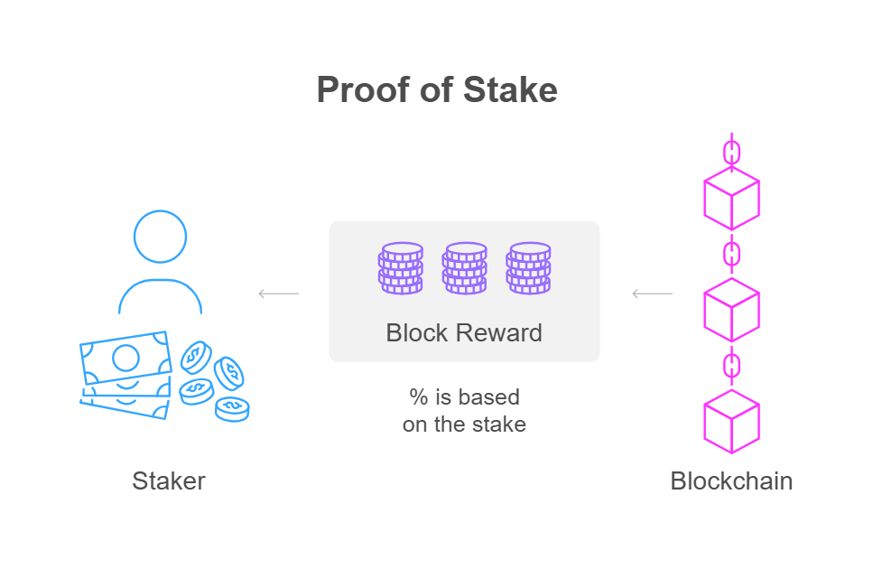

    
<code>IMAGEM | Como funciona a Proof of Stake</code>

O ***Staker*** (participante - **staker**) ganha como recompensa um percentual baseado na aposta (**stake**).

A mecânica de como os criadores de blocos são selecionados com base nas apostas varia de acordo com a implemnentação.
Em algumas implementações, a probabilidade de ser selecionado é diretamente proporcional ao tamanho da aposta do 
usuário. Em outros, o conceito de idade da moeda é introduzido e os apostadores que não foram selecionados para criar 
um bloco em algum momento têm uma probabilidade maior de serem selecionados. Independentemente disso, **o controle de
mais criptomoedas apostadas no *Proof of Stake* equivale a um maior controle sobre a blockchain**.

(<a href="#readme-top">back to top</a>)

# ATAQUE DE 51%

Um ataque de 51% ocorre quando um único minerrador de criptomoeda ou grupo de mineradores obtém controle de mais de 50%
da blockchain de uma rede.

Quando a maioria do hashrate é controlada por um ou mais mineradores em um ataque de 51%, a rede de criptomoedas é
interrompida. Os responsáveis por um ataque de 51% seriam então capazes de:

- Excluir novas transações do registro.
- Modificar a ordem das transações.
- Impedir que transações sejam validadas ou confirmadas.
- Bloquear outros mineradores de minerar moedas ou tokens dentro da rede.
- Reverter transações para gastar moedas em dobro.

(<a href="#readme-top">back to top</a>)
