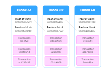

    <h1 align=center>BLOCKCHAIN</h1>

# Table of Contents
- [Conceitos da Tecnologia ***BLOCKCHAIN***](#conceitos-da-tecnologia-blockchain)
- [Início da Blockchain: ***CRIPTOMOEDAS***](#início-da-blockchain-criptomoedas)
- [Whitepaper do ***BITCOIN***](#whitepaper-do-bitcoin)
- [Fundamentação Tecnológica ***BLOCKCHAIN***](#fundamentação-tecnológica-blockchain)
- [Criptografia de ***Chave Pública***](#criptografia-de-chave-pública)
- [Formação de Blocos](#formação-de-blocos)
- [Encadeamento](#encadeamento)
- [Plataforma ***BLOCKCHAIN***](#plataforma-blockchain)
- [Algoritmo de Consenso](#algoritmo-de-consenso)
- [Ataque de 51%](#ataque-de-51)

# CONCEITOS DA TECNOLOGIA *BLOCKCHAIN*

**Blockchain** é definida de forma simples como um **livro-razão** descentralizado e distribuído que registra a rastreabilidade de um ativo digital. Desde a sua criação, os dados em uma blockchain não podem ser modificados e excluídos.

Um dos grandes problemas que a blockchain nasceu para resolver foi o **gasto duplo**. Não é possível enviar o mesmo ativo para duas pessoas, algo que pode acontecer dentro de um banco de dados, dependendo da arquitetura com que ele foi criado.

> Exemplo de como acontece o envio do mesmo ativo para duas pessoas:

Há algumas coisas que podem dar errado quando você tenta enviar um ativo digital para duas pessoas ao mesmo tempo.

- Algo pode ter dado errado no banco de dados (problema técnico).
- A conta do remetente pode ter sido hackeada
- Os limites de transferência do dia podem ter sido excedidos
- Debitado de uma conta, nunca creditando no outro lado
- Problemas com dados

    
<code>IMAGEM | Processos</code>

1. **A** quer enviar dinheiro para **B**
2. A transação é representada online como um "bloco"
3. O bloco é transmitido para cada participante na rede
4. As pessoas na rede atestam se a transação é válida
5. O bloco é então adicionado à cadeia, o que confere um registro idôneo (adequado) e transparente nas transições
6. O dinheiro é movido de **A** para **B**

Todas essas transações são armazenadas na estrutura de **livro-razão** digital. Funciona como uma planilha contendo todos os inúmeros nós de uma rede e tem o histórico de todas as compras feitas por cada nó. As informações contidas no livro digital são altamente seguras e a assinatura digital protege contra adulterações.

Qualquer um pode ver os dados do livro-razão, mas ninguém pode corrompê-los. Só é possível inserir informações na blockchain, não é possível deletar nem alterar o dado que outro participante já inseriu.

> De forma geral:
> 
> - Blockchain é um banco de dados que armazena blocos de dados criptografados e os encadeia para formar uma única fonte de verdade cronológica para os dados.
> - Os ativos digitais são distribuídos em vez de copiados ou transferidos, criando um registro imutável de um ativo.
> - O ativo é descentralizado, permitindo acesso total em tempo real e transparência ao público.
> - Um registro transparente de alterações preserva a integridade do documento, o que cria confiança no ativo.
> - As medidas de segurança inerentes ao Blockchain e o livro-razão público o tornam uma tecnologia primordial para quase todos os setores.

(<a href="#readme-top">back to top</a>)

## Blocos

Um bloco consiste em uma lista de dados. Uma "cadeia" é um conjunto de cloco de dados que cresce constantemente ao longo de um período de tempo. Se a transação estiver inserida na blockchain, será extremamente difícil ou impossível alterar esses dados. Isso torna a blockchain um meio único de armazenar dados valiosos.

Imagine uma torre digital de blocos, osbre a qual um novo bloco de dados é adicionado a cada 10 minutos a partir do "**bloco de gênese**" original na base da torre. Os dados em cada bloco consistem em transações financeiras transmitidas por usuários da rede juntamente com evidências criptográficas de que essas transações são válidas.

A figura representa como os blocos são encadeados em uma blockchain:

(<a href="#readme-top">back to top</a>)

## Mineração

Mineração é a extração da moeda digital usando equipamentos especiais (computadores potentes).

A mineração é a junção de blocos que armazenam informações sobre transações. Como resultado, eles formam uma cadeia contínua e consistente.

Para anexar um bloco, é necessário resolver um determinado problema matemático decifrando o algorítmo da criptomoeda. Caso o equipamento encontre a resposta correta, seu dono recebe uma recompensa em forma de moedas digitais, ou seja, recebe Bitcoin.

Quanto mais os mineradores buscam resolver o problema matemático, mais difícil é encontrar a resposta certa e o custo aumenta.

    
<code>IMAGEM | Processos</code>

1. Verifica Transações
2. Agrupa transações válidas em um **bloco "candidato"**
3. Insere a **hash** do bloco mais recente no bloco candidato
4. Resolve a **proof-of-work** (PoW)
5. Anexa o bloco candidato em uma blockchain local 
6. Propaga a solução na rede
7. Espera  a verificação da solução por outros **nodes**
8. Pegue a recompensa

(<a href="#readme-top">back to top</a>)

## Node

Temo utilizado para cada transação registrada cronologicamente e distribuída para uma série de dispositicos conectados. Esses dispositivos são chamados de **nós**. Esses nós se comunicam dentro da rede e transferem informações sobre transações e novos blocos.

É um componente crítico da infraestrutura blockchain. Ajuda a manter a segurança e a integridade da rede. O principal objetivo de um nó blockchain é verificar cada lote de transações de rede, chamados de blocos. Cada nó é distinguido dos outros por um identificador único.

    
<code>IMAGEM | Processos</code>

1. **Node** (membro da rede blockchain) envia um pedido de transação para a rede blockchain
2. Bloco criptografado é criado
3. Outros nodes validam a transação
4. Bloco adicionado à blockchain
5. Todos os nodes recebem o novo bloco

Existem basicamente quatro tipos de nós

|       Node       | Descrição                                                                                                                                                                                                                                                            |
|:----------------:|:---------------------------------------------------------------------------------------------------------------------------------------------------------------------------------------------------------------------------------------------------------------------|
|  **Full Node**   | Executam a função de manter e distribuir cópias de todo o registro da blockchain, validando o histórico da blockchain e retransmitindo-o para outros nós da rede                                                                                                     |
| **Super Nodes**  | Operam 24 horas por dia para conectar os *full nodes* uns aos outros e espalhar a blockchain por toda a rede. Os *super nodes* servem como retransmissores de informações ou redistribuição para garantir que todos tenham a cópia correta da blockchain do Bitcoin. |
| **Light Nodes**  | Executam funções semelhantes aos *full nodes*, mas em uma capacidade menor. Eles contêm pequenas porções da blockchain em oposição à cópia inteira.                                                                                                                  |
| **Mining Nodes** | Resolvem problemas computacionais complexos usando hardware especializado por meio de "mineração", o processo de criação e adição de novos blocos à blockchain. Os mineradores bem-sucedidos recebem uma recompensa em Bitcoin por criar o novo bloco.               |

(<a href="#readme-top">back to top</a>)

# INÍCIO DA BLOCKCHAIN: *CRIPTOMOEDAS*

(<a href="#readme-top">back to top</a>)

# WHITEPAPER DO *BITCOIN*

(<a href="#readme-top">back to top</a>)

# FUNDAMENTAÇÃO TECNOLÓGICA *BLOCKCHAIN*

(<a href="#readme-top">back to top</a>)

## *Hash*

(<a href="#readme-top">back to top</a>)

# CRIPTOGRAFIA DE *CHAVE PÚBLICA*

(<a href="#readme-top">back to top</a>)

# FORMAÇÃO DE BLOCOS

(<a href="#readme-top">back to top</a>)

# ENCADEAMENTO

(<a href="#readme-top">back to top</a>)

# PLATAFORMA *BLOCKCHAIN*

(<a href="#readme-top">back to top</a>)

## Rede *Peer-to-Peer Blockchain*

(<a href="#readme-top">back to top</a>)

# ALGORITMO DE CONSENSO

    
<code>VÍDEO | Consenso</code>

(<a href="#readme-top">back to top</a>)

## Fundamentos do Consenso

(<a href="#readme-top">back to top</a>)

## Como os Algoritmos Comuns Implementam o Consenso

    
<code>VÍDEO | Blockchain: Ethereum</code>

(<a href="#readme-top">back to top</a>)

## Prova de Trabalho

(<a href="#readme-top">back to top</a>)

## Prova de Participação

(<a href="#readme-top">back to top</a>)

# ATAQUE DE 51%